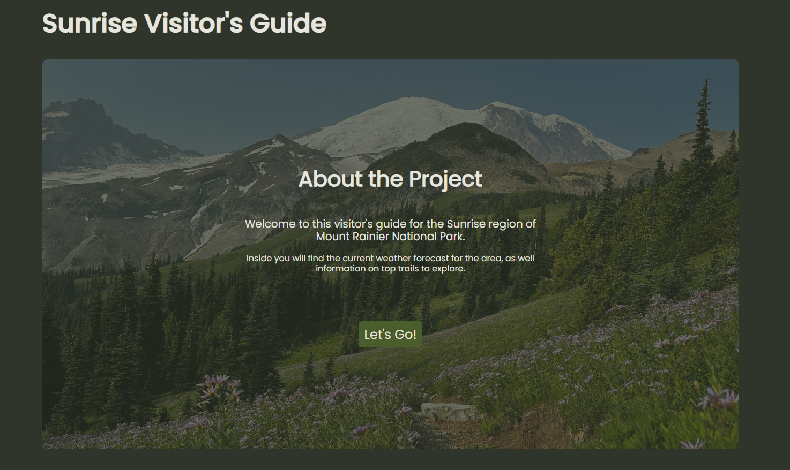
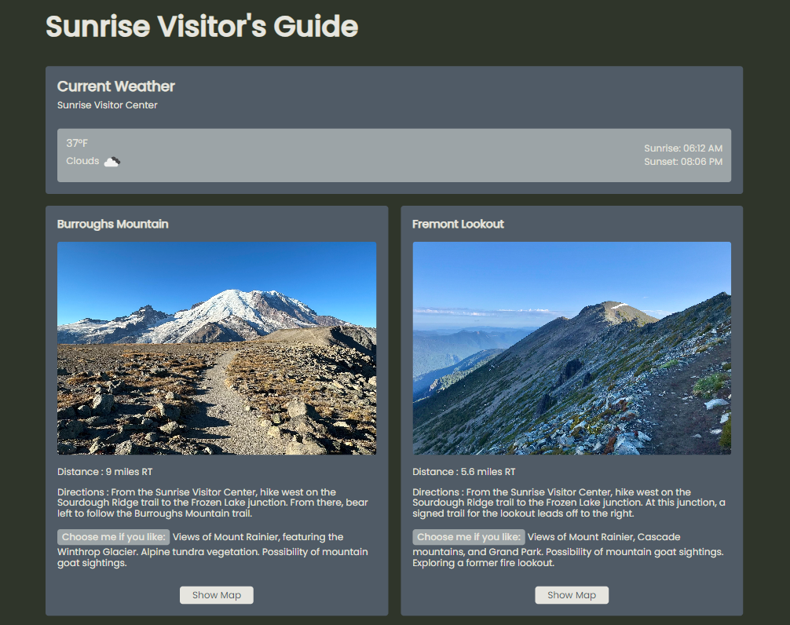
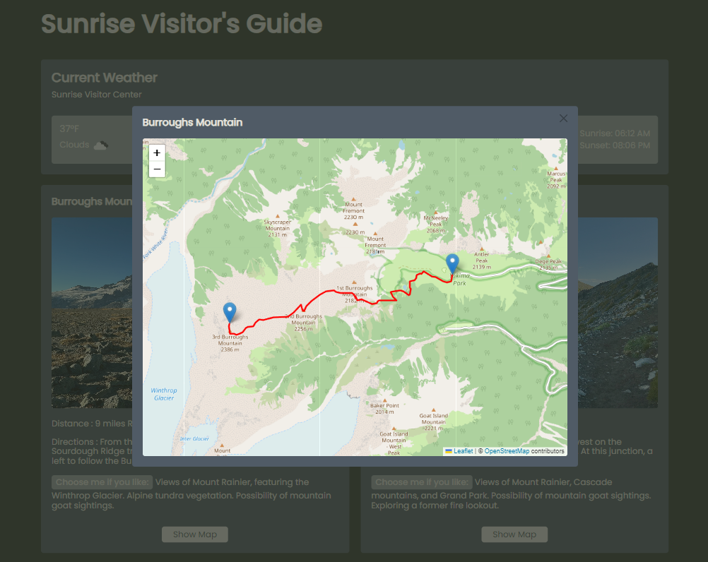

# Sunrise Visitor's Guide

## Project overview

This front-end application was completed as a capstone project for the Software Engineering program at Triple Ten. It provides an interactive visitor's guide for the Sunrise region of Mount Rainier National Park.

The project was developed independently from the ground up, encompassing all stages of the development lifecycle, including:

- Conceptualization and project planning
- UI/UX design
- Frontend architecture design and implementation
- Integration of external API
- Testing and debugging
- Deployment

## Key features

- Real-time Weather Information: Integrates with OpenWeatherMap API to provide current weather, as well as sunrise/sunset times for the park area.
- Trail Guide: Displays concise yet detailed information about area hiking trails, including distance, directions, and features.
- Interactive Mapping: Utilizes React Leaflet to render interactive maps, allowing users to visualize trail routes and points of interest.
- Responsive design: Ensures a seamless experience for desktop, tablet, and mobile devices.

## Technologies used

- React
- React Router
- React Leaflet
- Javascript
- CSS
- External API

## Gallery

## Links

[GitHub pages](https://lisaatea.github.io/sunrise-visitor-guide-frontend/)
